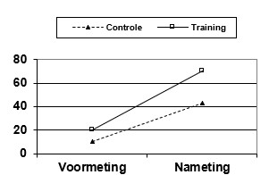

```{r, echo = FALSE, results = "hide"}
include_supplement("uu-Mixed-design-ANOVA-606-nl-tabel.jpg", recursive = TRUE)
```

Question
========
  
Een pedagogisch onderzoeker evalueert met behulp van een quasi-experimenteel ontwerp een nieuwe trainingsmethode. Zij gebruikt deze methode om bij gymles turnoefeningen aan te leren. Zij gebruikt twee klassen van dezelfde school, waarbij één klas de nieuwe lesmethode krijgt (trainingsgroep), en de andere klas de oude lesmethode (controlegroep). Beide klassen weten niet dat zij een verschillende training krijgen. Het resultaat wordt gemeten door beoordeling door een getrainde turnbeoordelaar van enkele standaardoefeningen bij elke leerling. De groepsgemiddelden op voormeting en nameting ziet er als volgt uit:



De onderzoeker berekent voor iedere persoon de verschilscore tussen voormeting en nameting en deze zijn statistisch significant verschillend voor de twee groepen. Zij concludeert dat de nieuwe lesmethode de oorzaak is van de hogere resultaten bij de trainingsgroep in vergelijking met de controlegroep.
  
Answerlist
----------
* Deze conclusie is juist.
* Deze conclusie kan niet zonder meer getrokken worden, omdat de controleklas ontmoedigd kan zijn geraakt.
* Het is mogelijk dat bij de trainingsgroep een groter regressie-effect is opgetreden dan bij de controlegroep, waardoor het niet goed mogelijk is een uitspraak te doen over de nieuwe trainingsmethode.
* De opties a, b, en c zijn alle drie niet juist.


Solution
========
  


Meta-information
================
exname: uu-Mixed-design-ANOVA-606-nl.Rmd
extype: schoice
exsolution: 0001
exsection: Inferential Statistics/Parametric Techniques/ANOVA/Mixed design ANOVA
exextra[ID]: 7571c
exextra[Type]: Interpretating output
exextra[Language]: Dutch
exextra[Level]: Statistical Literacy
