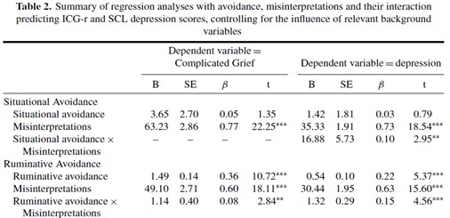

```{r, echo = FALSE, results = "hide"}
include_supplement("uu-Moderation-806-nl-tabel.jpg", recursive = TRUE)
```

Question
========
In the article by Boelen & van den Hout (2008) entitled The Role of Threatening Misinterpretations and Avoidance in Emotional Problems After Loss, complicated grief and depression symptoms are predicted by different forms of avoidance. The table below shows some of their results. 



Which conclusions is/are correct based on the information in the table above?

I There is mediation, the effect of Situational Avoidance on Depression is through the degree of Misinterpretation. II The relationship between Misinterpretation and Depression depends on the person's degree of Ruminative avoidance.

Answerlist
----------
* Both conclusions are correct
* Only conclusion 1 is correct
* Only conclusion 2 is correct
* Neither conclusion is correct


Solution
========
Conclusion 1 is incorrect. This table does not provide information on all four steps that must be followed to test mediation.

Conclusion 2 is correct. The ruminative avoidance * misinterpretations interaction is significant

Meta-information
================
exname: uu-Moderation-806-en
extype: schoice
exsolution: 0010
exsection: Inferential Statistics/Regression/Multiple linear regression/Moderation
exextra[ID]: 746be
exextra[Type]: Interpretating output
exextra[Language]: English
exextra[Level]: Statistical Literacy