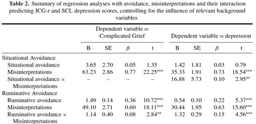

```{r, echo = FALSE, results = "hide"}
include_supplement("uu-Moderation-806-nl-tabel.jpg", recursive = TRUE)
```


Question
========
In het artikel van Boelen & van den Hout (2008) getiteld The Role of Threatening Misinterpretations and Avoidance in Emotional Problems After Loss, worden gecompliceerde rouw en depressie klachten voorspeld door verschillende vormen van ontwijking (avoidance). Onderstaande tabel laat een deel van hun resultaten zien. 



Welke conclusies is/zijn correct op basis van de informatie in bovenstaande tabel? 

I Er is sprake van mediatie, het effect van Situational Avoidance op Depressie verloopt via de mate van Misinterpretation. 
II De relatie tussen Misinterpretation en Depressie hangt af van de mate van Ruminative avoidance van de persoon.

Answerlist
----------
* Beide conclusies zijn correct
* Alleen conclusie 1 is correct
* Alleen conclusie 2 is correct
* Geen van beide conclusies is correct


Solution
========
Conclusie 1 is niet correct.
Deze tabel geeft geen informatie over alle vier de stappen die gevolgd moeten worden om mediatie te toetsen.

Conclusie 2 is correct.
De ruminative avoidance * misinterpretations interactie is significant


Meta-information
================
exname: uu-Moderation-806-nl
extype: schoice
exsolution: 0010
exsection: Inferential Statistics/Regression/Multiple linear regression/Moderation
exextra[Type]: Interpretating output
exextra[Language]: Dutch
exextra[Level]: Statistical Literacy