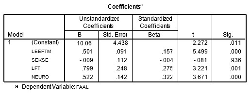

```{r, echo = FALSE, results = "hide"}
include_supplement("uu-Multiple-linear-regression-800-nl-tabel.jpg", recursive = TRUE)
```

Question
========
  
Using data from a study of adolescent fear of failure, an analysis examined the influence of age (Age), sex (Gender), maternal age (Age_M) and degree of neuroticism (NEURO) on fear of failure.

The table below shows the regression coefficients of the four predictors for the dependent variable degree of fear of failure (FAILURE).



Which predictor (given the other three predictors) contributes most to the prediction of the dependent variable fear of failure? 
Answerlist
----------
* Age of the mother
* Gender of the adolescent
* Age of the adolescent
* Neuroticism


Solution
========

Meta-information
================
exname: uu-Multiple-linear-regression-800-en
extype: schoice
exsolution: 0001
exsection: Inferential Statistics/Regression/Multiple linear regression
exextra[ID]: 9e741
exextra[Type]: Interpretating output
exextra[Program]: SPSS
exextra[Language]: English
exextra[Level]: Statistical Literacy
