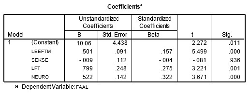

```{r, echo = FALSE, results = "hide"}
include_supplement("uu-Multiple-linear-regression-800-nl-tabel.jpg", recursive = TRUE)
```


Question
========
  
Met de gegevens van een onderzoek naar faalangst bij jongeren is in een analyse de invloed nagegaan van leeftijd (LFT), sekse (SEKSE),  leeftijd moeder (LEEFM) en mate van neuroticisme (NEURO) op faalangst.

In onderstaande tabel staan de regressiecoëfficiënten van de vier predictoren voor de afhankelijke variabele mate van faalangst (FAAL).



Welke predictor draagt (gegeven de overige drie predictoren) het meeste bij aan de voorspelling van de afhankelijke variabele faalangst?
  
Answerlist
----------
* Leeftijd van de moeder
* Sekse van de jongere
* Leeftijd van de jongere
* Neuroticisme


Solution
========
  


Meta-information
================
exname: uu-Multiple-linear-regression-800-nl.Rmd
extype: schoice
exsolution: 0001
exsection: Inferential Statistics/Regression/Multiple linear regression
exextra[ID]: ac7f3
exextra[Type]: Interpretating output
exextra[Program]: SPSS
exextra[Language]: Dutch
exextra[Level]: Statistical Literacy
