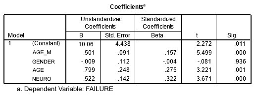

```{r, echo = FALSE, results = "hide"}
include_supplement("uu-Multiple-linear-regression-801-nl-tabel.jpg", recursive = TRUE)
```

Question
========
  
Using data from a study of adolescent fear of failure, an analysis examined the influence of age (LFT), sex (SEKSE), maternal age (LEEFM) and degree of neuroticism (NEURO) on fear of failure.

The table below shows the regression coefficients of the four predictors for the dependent variable degree of fear of failure (FAAL).




A person is 17 years old, the mother is 46 years old and the degree of neuroticism score is 14. What is the predicted value of this person's fear of failure? 
Answerlist
----------
* Ŷ = 26.01
* Ŷ = 46.69
* Ŷ = 54.00
* Ŷ = 62.62


Solution
========

Meta-information
================
exname: uu-Multiple-linear-regression-801-en
extype: schoice
exsolution: 0010
exsection: Inferential Statistics/Regression/Multiple linear regression
exextra[Type]: Interpretating output
exextra[Program]: SPSS
exextra[Language]: English
exextra[Level]: Statistical Literacy
