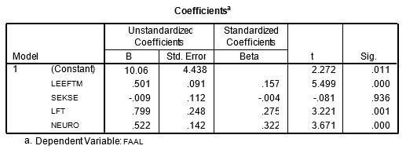

```{r, echo = FALSE, results = "hide"}
include_supplement("uu-Multiple-linear-regression-801-nl-tabel.jpg", recursive = TRUE)
```


Question
========
  
Met de gegevens van een onderzoek naar faalangst bij jongeren is in een analyse de invloed nagegaan van leeftijd (LFT), sekse (SEKSE),  leeftijd moeder (LEEFM) en mate van neuroticisme (NEURO) op faalangst.

In onderstaande tabel staan de regressiecoëfficiënten van de vier predictoren voor de afhankelijke variabele mate van faalangst (FAAL).




Een persoon is 17 jaar, de moeder is 46 jaar en de mate van neuroticsme score is 14. Wat is de voorspelde waarde van de faalangst van deze persoon?
  
Answerlist
----------
* ŷ = 26.01
* ŷ = 46.69
* ŷ = 54.00 
* ŷ = 62.62


Solution
========
  


Meta-information
================
exname: uu-Multiple-linear-regression-801-nl.Rmd
extype: schoice
exsolution: 0010
exsection: Inferential Statistics/Regression/Multiple linear regression
exextra[Type]: Interpretating output
exextra[Program]: SPSS
exextra[Language]: Dutch
exextra[Level]: Statistical Literacy
