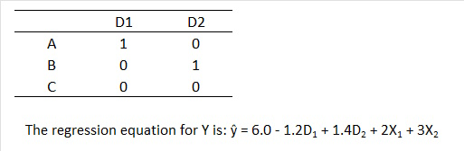

```{r, echo = FALSE, results = "hide"}
include_supplement("uu-Multiple-linear-regression-802-nl-tabel.jpg", recursive = TRUE)
```

Question
========
  
In subjects, decreases in depression are measured on a continuous scale (Y). One is interested in the effects of three types of therapies: A, B or C, but one also measures background variables X1 and X2. To predict the decrease in depression, two dummy variables are created for therapy:



The estimated decrease in depression for individuals who attended therapy A and have scores X1 = 1 and X2 = 2 is: 
Answerlist
----------
* 4.8
* 10.5
* 12.8
* 15.4


Solution
========

Meta-information
================
exname: uu-Multiple-linear-regression-802-en
extype: schoice
exsolution: 0010
exsection: Inferential Statistics/Regression/Multiple linear regression
exextra[ID]: cdc2d
exextra[Type]: Interpretating output
exextra[Program]: SPSS
exextra[Language]: English
exextra[Level]: Statistical Literacy
