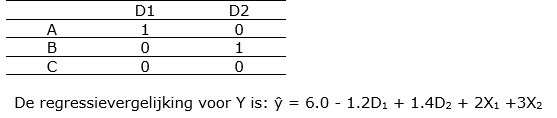

```{r, echo = FALSE, results = "hide"}
include_supplement("uu-Multiple-linear-regression-802-nl-tabel.jpg", recursive = TRUE)
```


Question
========
  
Bij proefpersonen wordt afname van depressiviteit gemeten op een continue schaal (Y). Men is geïnteresseerd in de effecten van drie soorten van therapieën: A, B of C,  maar men meet ook achtergrondvariabelen X1 en X2. Om de afname van depressiviteit  te voorspellen worden voor therapie twee dummy-variabelen gemaakt:



De geschatte afname van depressiviteit voor personen die therapie A volgden en de scores X1 = 1 en X2 = 2 hebben is:
  
Answerlist
----------
* 4.8
* 10.5
* 12.8
* 15.4


Solution
========
  


Answerlist
----------


Meta-information
================
exname: uu-Multiple-linear-regression-802-nl.Rmd
extype: schoice
exsolution: 0010
exsection: Inferential Statistics/Regression/Multiple linear regression
exextra[Type]: Interpretating output
exextra[Program]: SPSS
exextra[Language]: Dutch
exextra[Level]: Statistical Literacy
