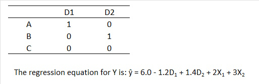

```{r, echo = FALSE, results = "hide"}
include_supplement("uu-Multiple-linear-regression-803-nl-tabel.jpg", recursive = TRUE)
```


Question
========
  
In subjects, decreases in depression are measured on a continuous scale (Y). One is interested in the effects of three types of therapies: A, B or C, but one also measures background variables X1 and X2. To predict the decrease in depression, two dummy variables are created for therapy:



When choosing the two dummy variables, one of the therapies became reference category. If another category is chosen as the reference category, then... 
Answerlist
----------
* Changes the estimated decrease in depression of a person
* Changes the constant (the intercept)
* Changes the B values of the dummy variables
* More than one of the three alternatives (a), (b) and (c) is TRUE 


Solution
========

Meta-information
================
exname: uu-Multiple-linear-regression-803-en
extype: schoice
exsolution: 0001
exsection: Inferential Statistics/Regression/Multiple linear regression
exextra[ID]: 46e25
exextra[Type]: Interpretating output
exextra[Program]: SPSS
exextra[Language]: English
exextra[Level]: Statistical Literacy
