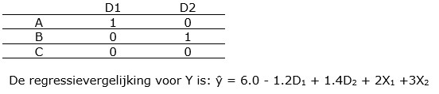

```{r, echo = FALSE, results = "hide"}
include_supplement("uu-Multiple-linear-regression-803-nl-tabel.jpg", recursive = TRUE)
```


Question
========
  
Bij proefpersonen wordt afname van depressiviteit gemeten op een continue schaal (Y). Men is geïnteresseerd in de effecten van drie soorten van therapieën: A, B of C,  maar men meet ook achtergrondvariabelen X1 en X2. Om de afname van depressiviteit  te voorspellen worden voor therapie twee dummy-variabelen gemaakt:



Bij de keuze voor de twee dummy-variabelen is een van de therapieën referentiecategorie geworden. Indien een andere categorie als referentiecategorie wordt gekozen, dan… 
  
Answerlist
----------
* verandert de geschatte afname in depressiviteit van een persoon
* verandert de constante (het intercept) 
* veranderen de B-waarden van de dummy-variabelen
* Meer dan één van de drie alternatieven a), b) en c) is waar 


Solution
========
  
Meta-information
================
exname: uu-Multiple-linear-regression-803-nl
extype: schoice
exsolution: 0001
exsection: Inferential Statistics/Regression/Multiple linear regression
exextra[Type]: Interpretating output
exextra[Program]: SPSS
exextra[Language]: Dutch
exextra[Level]: Statistical Literacy
