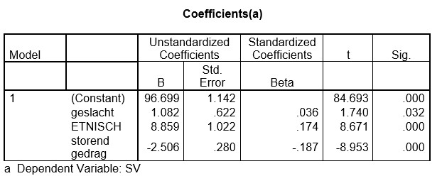

```{r, echo = FALSE, results = "hide"}
include_supplement("uu-Multiple-linear-regression-804-nl-tabel.jpg", recursive = TRUE)
```


Question
========
  
Onderstaande tabel is altijd onderdeel van de uitvoer die SPSS geeft als je een multipele regressieanalyse uitvoert. De afhankelijke variabele is schoolprestaties (SV), de onafhankelijke variabelen zijn: geslacht (0 = meisje, 1 = jongen), etnische afkomst (1 = Nederlands, 0 = anders) en storend gedrag (hogere score komt overeen met meer storend gedrag).



Wat is de (afgeronde) voorspelde score voor een Nederlands meisje, die een score van 2 heeft op de schaal van storend gedrag?
  
Answerlist
----------
* 3.8
* 6.4
* 100.5 
* 104.1


Solution
========
  
Meta-information
================
exname: uu-Multiple-linear-regression-804-nl
extype: schoice
exsolution: 0010
exsection: Inferential Statistics/Regression/Multiple linear regression
exextra[Type]: Interpretating output
exextra[Program]: SPSS
exextra[Language]: Dutch
exextra[Level]: Statistical Literacy
