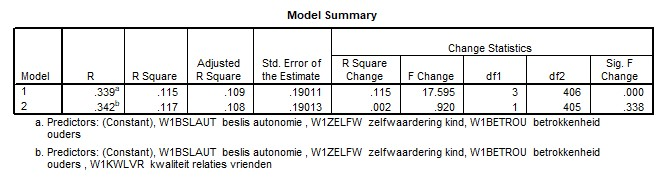

```{r, echo = FALSE, results = "hide"}
include_supplement("uu-Multiple-linear-regression-806-nl-tabel.jpg", recursive = TRUE)
```

Question
========
  
A researcher examines the influence of "Quality Relationships with Friends" (KWLVR) for the degree of externalizing problem behavior (EXT). She hypothesizes that this predictor over three other variables may explain additional variance in the dependent variable. The other three variables are Decision Autonomy, Self-Esteem and Parental Involvement. View the "Model Summary" table of the multiple regression analysis.



Which conclusion regarding the explained variance of Model 1 is correct? 
Answerlist
----------
* The explained variance in the sample is 11.5%
* The explained variance in the population is 11.5%
* The explained variance in the sample is 33.9%.
* The explained variance in the population is 33.9%


Solution
========

Meta-information
================
exname: uu-Multiple-linear-regression-806-en
extype: schoice
exsolution: 1000
exsection: Inferential Statistics/Regression/Multiple linear regression
exextra[ID]: c90d4
exextra[Type]: Interpretating output
exextra[Program]: SPSS
exextra[Language]: English
exextra[Level]: Statistical Literacy
