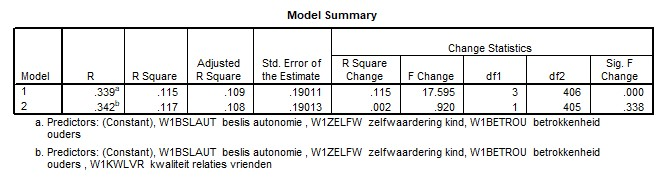

```{r, echo = FALSE, results = "hide"}
include_supplement("uu-Multiple-linear-regression-806-nl-tabel.jpg", recursive = TRUE)
```

Question
========
  
Een onderzoekster gaat de invloed na van de 'Kwaliteit relaties met vrienden' (KWLVR) voor de mate van externaliserend probleemgedrag (EXT). Ze veronderstelt dat deze predictor boven drie andere variabelen extra variantie kan verklaren in de afhankelijke variabele. De andere drie variabelen zijn Beslisautonomie, Zelfwaardering en Betrokkenheid ouders. Bekijk de tabel 'Model Summary' van de multipele regressieanalyse.



Welke conclusie met betrekking tot de verklaarde variantie van Model 1 is correct? 
  
Answerlist
----------
* De verklaarde variantie in de steekproef is 11,5% 
* De verklaarde variantie in de populatie is 11,5%
* De verklaarde variantie in de steekproef is 33,9%
* De verklaarde variantie in de populatie is 33,9%


Solution
========
  

Meta-information
================
exname: uu-Multiple-linear-regression-806-nl
extype: schoice
exsolution: 1000
exsection: Inferential Statistics/Regression/Multiple linear regression
exextra[Type]: Interpretating output
exextra[Program]: SPSS
exextra[Language]: Dutch
exextra[Level]: Statistical Literacy
