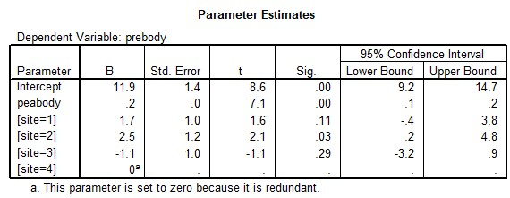

```{r, echo = FALSE, results = "hide"}
include_supplement("uu-Multiple-linear-regression-807-nl-tabel.jpg", recursive = TRUE)
```


Question
========
  
Een onderwijskundige wil onderzoeken of voorkennis van lichaamsdelen (PREBODY) afhankelijk is van woonomgeving (site) en algemene ontwikkeling (PEABODY). Voor woonomgeving worden vier categorieën onderscheiden:

Site 1 = stad bevoordeeld
Site 2 = buitenwijk
Site 3 = stad benadeeld
Site 4 = dorp 

Er is gebruik gemaakt van de gegevens uit het Sesamstraat onderzoek. De uitvoer van de analyse (parameter schattingen) is gegeven.




Wat is de voorspelde score op PREBODY voor een kind dat woont in een buitenwijk en met een peabody-score van 60?
  
Answerlist
----------
* 12.0
* 14.5
* 26.4
* 62.5


Solution
========
 

Meta-information
================
exname: uu-Multiple-linear-regression-807-nl
extype: schoice
exsolution: 0010
exsection: Inferential Statistics/Regression/Multiple linear regression
exextra[ID]: a1bcc
exextra[Type]: Interpretating output
exextra[Program]: SPSS
exextra[Language]: Dutch
exextra[Level]: Statistical Literacy
