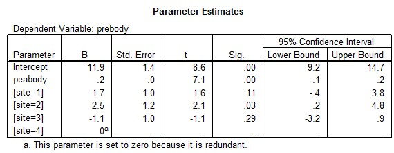

```{r, echo = FALSE, results = "hide"}
include_supplement("uu-Multiple-linear-regression-808-nl-tabel.jpg", recursive = TRUE)
```


Question
========
  
Een onderwijskundige wil onderzoeken of voorkennis van lichaamsdelen (PREBODY) afhankelijk is van woonomgeving (site) en algemene ontwikkeling (PEABODY). Voor woonomgeving worden vier categorieën onderscheiden:

Site 1 = stad bevoordeeld
Site 2 = buitenwijk
Site 3 = stad benadeeld
Site 4 = dorp 

Er is gebruik gemaakt van de gegevens uit het Sesamstraat onderzoek. De uitvoer van de analyse (parameter schattingen) is gegeven.




Welke van de onderstaande conclusies is als enige juist?
  
Answerlist
----------
* Als PEABODY een punt stijgt dan verandert de voorspelde score op PREBODY 11.9 punten.
* Het verschil tussen de categorie ‘stad bevoordeeld’ en het intercept van de referentiecategorie is 11.9 punten.
* De gemiddelde voorspellingsfout voor de vier categorieën van de variabele SITE is gelijk aan 11.9 punten.
* Het intercept van de vergelijking van referentie groep is gelijk aan 11.9 punten.


Solution
========
  

Meta-information
================
exname: uu-Multiple-linear-regression-808-nl
extype: schoice
exsolution: 0001
exsection: Inferential Statistics/Regression/Multiple linear regression
exextra[Type]: Interpretating output
exextra[Program]: SPSS
exextra[Language]: Dutch
exextra[Level]: Statistical Literacy
