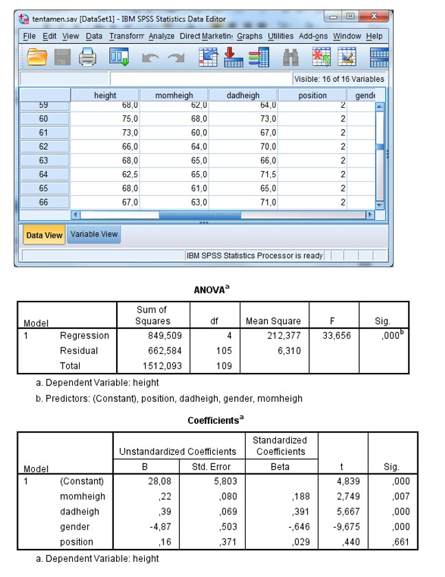

```{r, echo = FALSE, results = "hide"}
include_supplement("uu-Multiple-linear-regression-810-nl-tabel.jpg", recursive = TRUE)
```

Question
========
  
A student at the University of London has collected data among his fellow students. He wants to create a model to predict students' height (measured in inches, VB: 1.70 m = 67 inches) based on their parents' height, their sex (male = 0, female = 1) and their position within the family. Part of the SPSS data and SPSS output are below.



How much longer do we estimate the average height of boys than girls? 
Answerlist
----------
* 4.87
* 5.80
* 9.68
* 28.08


Solution
========

Meta-information
================
exname: uu-Multiple-linear-regression-810-en
extype: schoice
exsolution: 1000
exsection: Inferential Statistics/Regression/Multiple linear regression
exextra[Type]: Interpretating output
exextra[Program]: SPSS
exextra[Language]: English
exextra[Level]: Statistical Literacy
