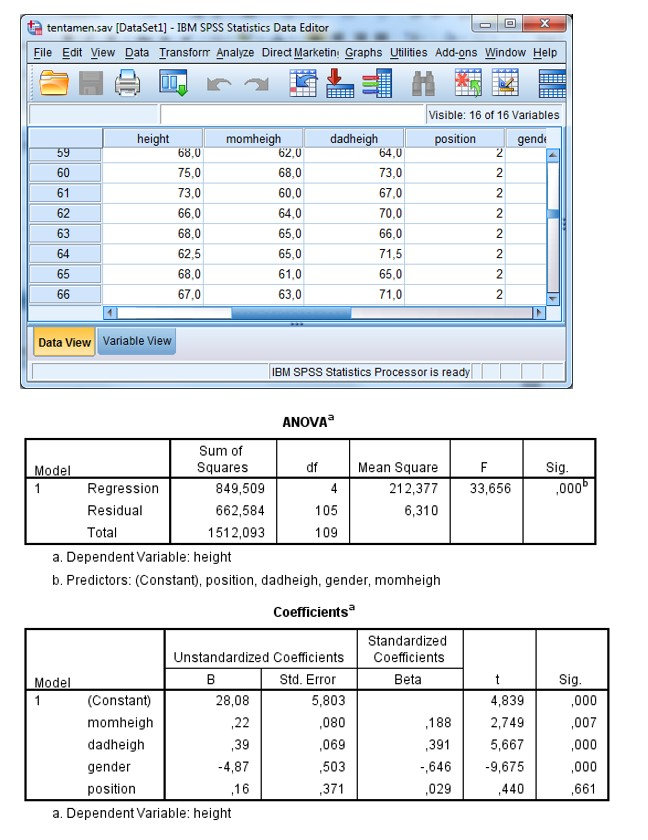

```{r, echo = FALSE, results = "hide"}
include_supplement("uu-Multiple-linear-regression-812-nl-tabel.jpg", recursive = TRUE)
```

```{r, echo = FALSE, results = "hide"}
include_supplement("uu-Multiple-linear-regression-812-nl-tabel2.jpg", recursive = TRUE)
```

```{r, echo = FALSE, results = "hide"}
include_supplement("uu-Multiple-linear-regression-812-nl-tabel3.jpg", recursive = TRUE)
```


Question
========
  
A student at the University of London has collected data among his fellow students. He wants to create a model to predict students' height (measured in inches, VB: 1.70 m = 67 inches) based on their parents' height, their sex (male = 0, female = 1) and their position within the family. Part of the SPSS data and SPSS output are below.



The student wants to try to reduce the number of predictors in the model and compares the earlier model to the model with only the lengths of parents in the model. Another part of the SPSS output is below. 


Which model should the student end up using to make predictions? Use all the information in the output above as well as on the previous page. 
Answerlist
----------
* Predicted height = b0 + b1×momheigh + b2×dadheigh + b3×gender + b4×position
* Predicted height = b0 + b1×momheigh + b2×dadheigh + b3×gender
* Predicted height = b0 + b1×momheigh + b2×dadheigh
* Predicted height = b0 + b1×dadheigh 


Solution
========

Meta-information
================
exname: uu-Multiple-linear-regression-812-en
extype: schoice
exsolution: 0100
exsection: Inferential Statistics/Regression/Multiple linear regression
exextra[ID]: 9a167
exextra[Type]: Interpretating output
exextra[Program]: SPSS
exextra[Language]: English
exextra[Level]: Statistical Literacy
