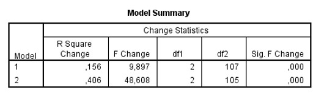
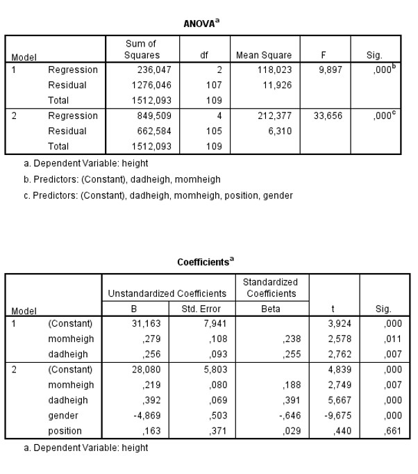

```{r, echo = FALSE, results = "hide"}
include_supplement("uu-Multiple-linear-regression-812-nl-tabel.jpg", recursive = TRUE)
```

```{r, echo = FALSE, results = "hide"}
include_supplement("uu-Multiple-linear-regression-812-nl-tabel2.jpg", recursive = TRUE)
```

```{r, echo = FALSE, results = "hide"}
include_supplement("uu-Multiple-linear-regression-812-nl-tabel3.jpg", recursive = TRUE)
```


Question
========
  
Een student aan de universiteit van London heeft data verzameld onder zijn medestudenten. Hij wil een model maken om de lengte van studenten te voorspellen (gemeten in inches, VB: 1,70 m = 67 inches) aan de hand van de lengte van hun ouders, hun sekse (male = 0, female = 1) en hun positie binnen het gezin. Deel van de SPSS data en de SPSS output staan hieronder.


De student wil proberen het aantal predictoren in het model te reduceren en vergelijkt het eerdere model met het model met alleen de lengtes van de ouders in het model. Nog een deel van de SPSS output staat hieronder. 





Welk model zou de student uiteindelijk moeten gebruiken om voorspellingen mee te maken? Gebruik hiervoor alle informatie in de output hierboven èn op de vorige pagina. 
  
Answerlist
----------
* predicted height = b0 + b1×momheigh + b2×dadheigh + b3×gender + b4×position
* predicted height = b0 + b1×momheigh + b2×dadheigh + b3×gender
* predicted height = b0 + b1×momheigh + b2×dadheigh 
* predicted height = b0 + b1×dadheigh 


Solution
========
  


Answerlist
----------


Meta-information
================
exname: uu-Multiple-linear-regression-812-nl.Rmd
extype: schoice
exsolution: 0100
exsection: Inferential Statistics/Regression/Multiple linear regression
exextra[Type]: Interpretating output
exextra[Program]: SPSS
exextra[Language]: Dutch
exextra[Level]: Statistical Literacy
