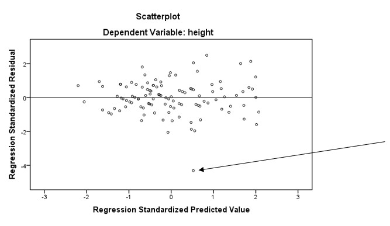

```{r, echo = FALSE, results = "hide"}
include_supplement("uu-Multiple-linear-regression-813-nl-tabel.jpg", recursive = TRUE)
```


Question
========
Een student aan de universiteit van London heeft data verzameld onder zijn medestudenten. Hij wil een model maken om de lengte van studenten te voorspellen (gemeten in inches, VB: 1,70 m = 67 inches) aan de hand van de lengte van hun ouders, hun sekse (male = 0, female = 1) en hun positie binnen het gezin. 

De student wil proberen het aantal predictoren in het model te reduceren en vergelijkt het eerdere model met het model met alleen de lengtes van de ouders in het model. 
Van dit model zijn ook de voorwaarden gecontroleerd. Een van de grafieken staat hieronder.



Welke uitspraak is correct over de observatie waar de pijl bij staat?
  
Answerlist
----------
* Deze observatie zorgt ervoor dat er niet voldaan is aan de homoscedasticiteit voorwaarde en moet zondermeer verwijderd worden.
* Deze student is in het echt veel minder lang dan dat we voorspellen aan de hand van dit model. 
* We voorspellen deze student veel minder lang dan dat de student in het echt is.
* Deze observatie is een uitschieter en daarom is er niet voldaan aan de voorwaarde dat de residuen normaal verdeeld zijn. 


Solution
========


Meta-information
================
exname: uu-Multiple-linear-regression-813-nl
extype: schoice
exsolution: 0100
exsection: Inferential Statistics/Regression/Multiple linear regression
exextra[Type]: Interpretating output
exextra[Program]: SPSS
exextra[Language]: Dutch
exextra[Level]: Statistical Literacy
