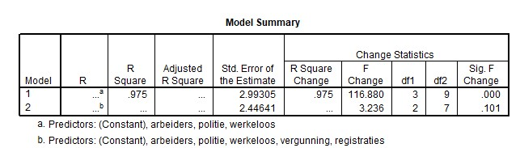

```{r, echo = FALSE, results = "hide"}
include_supplement("uu-Multiple-linear-regression-814-nl-tabel.jpg", recursive = TRUE)
```

Question
========
  
To predict the number of homicides (per year in a given area), a model is sought by a criminologist. Data were collected over the past few years on the following variables:

murders/homicides: the number of murders per 100,000 
permits: the number of gun permits of inhabitants issued that year 
unemployed: unemployment rate 
police: the number of full-time police officers per 100,000 population 
workers: indication of the number of minimum wage workers 
registrations: the number of guns registered

First, a regression model is proposed with homicides as the dependent variable and all other variables as predictors. Two of the 5 variables are found to be not significant in this model. The criminologist would like to compare the two models. Part of the SPSS output is shown below.




What do we know about the value of the percent explained variance of the model with all five predictors? 
Answerlist
----------
* $R^2$ < 0.975
* $R^2$ = 0.975
* $R^2$ > 0.975
* Unknown


Solution
========

Meta-information
================
exname: uu-Multiple-linear-regression-814-en
extype: schoice
exsolution: 0010
exsection: Inferential Statistics/Regression/Multiple linear regression
exextra[ID]: f0d3a
exextra[Type]: Interpretating output
exextra[Program]: SPSS
exextra[Language]: English
exextra[Level]: Statistical Literacy
