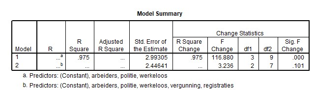

```{r, echo = FALSE, results = "hide"}
include_supplement("uu-Multiple-linear-regression-814-nl-tabel.jpg", recursive = TRUE)
```


Question
========
  
Om het aantal moorden (per jaar in een bepaald gebied) te kunnen voorspellen wordt door een criminoloog een model gezocht. Er zijn over de afgelopen jaren data verzameld over de volgende variabelen:

moorden het aantal moorden per 100.000 inwoners
vergunning het aantal wapenvergunningen verstrekt dat jaar
werkeloos werkeloosheidspercentage
politie het aantal fulltime politieagenten per 100.000 inwoners
arbeiders indicatie van het aantal minimumloon arbeiders
registraties het aantal geregistreerde wapens

Eerst wordt er een regressie model voorgesteld met moorden als afhankelijke variabele en alle andere variabelen als predictoren. Twee van de 5 variabelen blijken niet significant in dit model. De criminoloog wil graag de twee modellen vergelijken. Een deel van de SPSS output staat hieronder.




Wat weten we over de waarde van het percentage verklaarde variantie van het model met alle vijf de predictoren?
  
Answerlist
----------
* $R^2$ < 0.975 
* $R^2$ = 0.975
* $R^2$ > 0.975 
* onbekend


Solution
========
  


Answerlist
----------


Meta-information
================
exname: uu-Multiple-linear-regression-814-nl.Rmd
extype: schoice
exsolution: 0010
exsection: Inferential Statistics/Regression/Multiple linear regression
exextra[Type]: Interpretating output
exextra[Program]: SPSS
exextra[Language]: Dutch
exextra[Level]: Statistical Literacy
