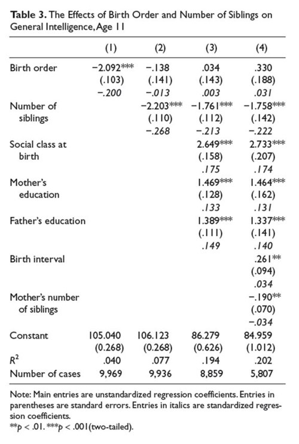

```{r, echo = FALSE, results = "hide"}
include_supplement("uu-multiple-linear-regression-819-nl-tabel.jpg", recursive = TRUE)
```
Question
========
The table below is from Kanazawa's (2012) article. The table contains results of the analyses conducted to predict "General Intelligence, age 11." 



Two students both make statements about the table:

I Of 33 participants, it is unknown how many siblings they have II In model 4, "Father's education" is a stronger predictor of "Intelligence" than "Mother's education."

Which student is right?

Answerlist
----------
* Only student 1 is right
* Only student 2 is right
* Both student 1 and student 2 are right
* Neither student is right


Solution
========

Meta-information
================
exname: uu-multiple-linear-regression-819-en
extype: schoice
exsolution: 0010
exsection: Inferential Statistics/Regression/Multiple linear regression
exextra[Type]: Interpretating output
exextra[Program]: 
exextra[Language]: English
exextra[Level]: Statistical Literacy