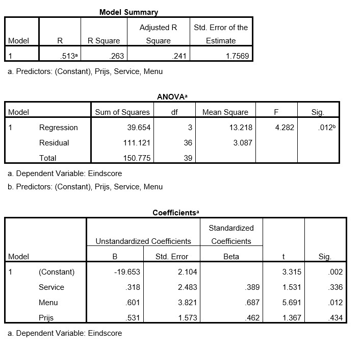

```{r, echo = FALSE, results = "hide"}
include_supplement("uu-Multiple-linear-regression-822-nl-tabel.jpg", recursive = TRUE)
```


Question
========
Marco, een culinair specialist uit Utrecht, wil voor de klanten van zijn magazine graag een goed advies uitbrengen over de prijs/kwaliteit verhouding van diverse restaurants in Utrecht gebaseerd op het jaar 2014. Hij heeft daarvoor 40 restaurants door zijn lezers laten beoordelen en heeft over een aantal indicatoren data verzameld: prijs voor een 3-gangen menu (in hele euro’s), kwaliteitsscore van het menu volgens lezers (1-10) en kwaliteitsscore voor de service volgens lezers (1-10). Zelf heeft hij een eigen eindoordeel aan deze restaurants toegekend (variabele = eindscore (1-10)). Hij bouwt een regressiemodel om de eindscore te voorspellen a.d.h.v. de prijs en de twee beoordelingen van de lezers. Hij is erg benieuwd hoe ver de voorspelde scores af zullen wijken van zijn eigen oordeel. 
Hieronder staat een deel van de SPSS output.

Welke variabele(n) voorspelt/voorspellen de eindscore NIET?




Answerlist
----------
* Alleen prijs
* Alleen kwaliteitsscore service
* Zowel prijs als kwaliteitsscore service
* Geen enkele predictor


Solution
========


Meta-information
================
exname: uu-Multiple-linear-regression-822-nl.Rmd
extype: schoice
exsolution: 0010
exsection: Inferential Statistics/Regression/Multiple linear regression
exextra[Type]: Interpretating output
exextra[Program]: SPSS
exextra[Language]: Dutch
exextra[Level]: Statistical Literacy