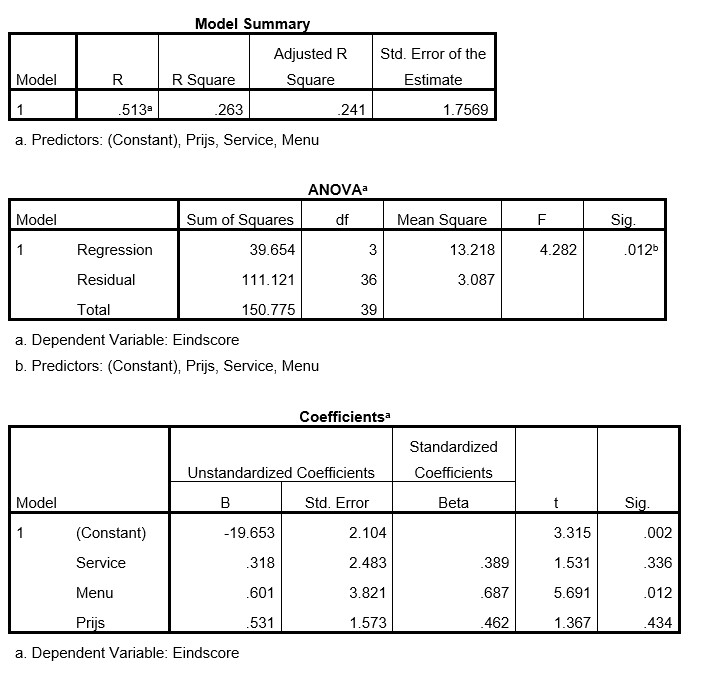

```{r, echo = FALSE, results = "hide"}
include_supplement("uu-Multiple-linear-regression-823-nl-tabel.jpg", recursive = TRUE)
```

Question
========
Marco, a culinary specialist from Utrecht, would like to give a good advice for the customers of his magazine about the price/quality ratio of various restaurants in Utrecht based on the year 2014. To this end, he has had 40 restaurants rated by his readers and has collected data on a number of indicators: price for a 3-course menu (in whole euros), quality score of the menu according to readers (1-10) and quality score for the service according to readers (1-10). He himself assigned his own final rating to these restaurants (variable = final score (1-10)). He is building a regression model to predict the final score using the price and the two readers' ratings. He is very curious how far the predicted scores will deviate from his own judgment. Below is part of the SPSS output.



Based on the above outputs, what do we conclude regarding the various tests we do?

Answerlist
----------
* The full model is significant and all individual predictors are significant
* The full model is significant but not all individual predictors are significant
* The full model is not significant but all individual predictors are significant
* The full model is not significant and not all individual predictors are significant


Solution
========

Meta-information
================
exname: uu-Multiple-linear-regression-823-en
extype: schoice
exsolution: 0100
exsection: Inferential Statistics/Regression/Multiple linear regression
exextra[ID]: 8dcd5
exextra[Type]: Interpretating output
exextra[Program]: SPSS
exextra[Language]: English
exextra[Level]: Statistical Literacy