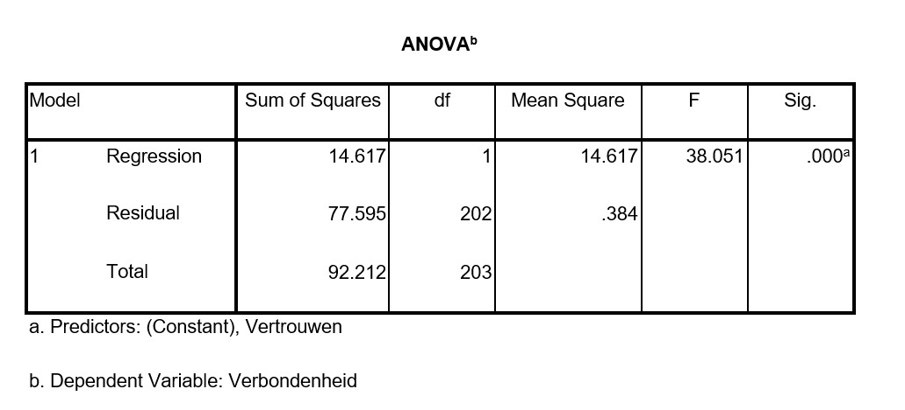

```{r, echo = FALSE, results = "hide"}
include_supplement("uu-Multiple-linear-regression-824-nl-graph01.jpg", recursive = TRUE)
```

Question
========
Jeroen conducted research among employees of a large company in the hospitality industry. He wants to know if the trust people have in their manager affects how connected they feel to the company. To study this, he created his own questionnaire. In addition to questions about trust in the supervisor and attachment to the company, he included general questions such as gender and what district people work in. After conducting several factor analyses, Jeroen created scales for trust in the supervisor and attachment to the company. Jeroen first wanted to find out if the trust people have in their supervisor could predict their attachment to the company. Below is part of the SPSS output.




Is trust a good predictor of connectedness?

Answerlist
----------
* Yes, because F is greater than 1 and so there is a significant linear relationship between trust and connectedness....
* Yes, because p < .001 and so there is a significant linear relationship between trust and connectedness.
* No, because the "Sig." value in the SPSS output is less than .05 and so trust is not a good predictor of connectedness.
* We cannot determine this from the above output.


Solution
========

Meta-information
================
exname: uu-Multiple-linear-regression-824-en
extype: schoice
exsolution: 0100
exsection: Inferential Statistics/Regression/Multiple linear regression
exextra[Type]: Interpretating output, Calculation
exextra[Program]: SPSS
exextra[Language]: English
exextra[Level]: Statistical Reasoning