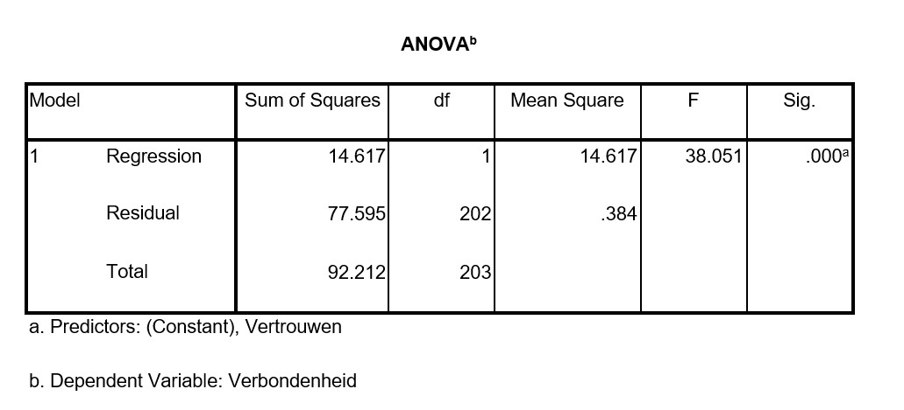

```{r, echo = FALSE, results = "hide"}
include_supplement("uu-Multiple-linear-regression-824-nl-graph01.jpg", recursive = TRUE)
```

Question
========
Jeroen heeft onderzoek gedaan onder medewerkers van een groot bedrijf in de horeca. Hij wil weten of het vertrouwen dat mensen hebben in hun leidinggevende invloed heeft op hoe verbonden ze zich voelen aan het bedrijf. Om dit te kunnen bestuderen heeft hij zelf een vragenlijst gemaakt. Behalve vragen over het vertrouwen in de leidinggevende en de verbondenheid aan het bedrijf heeft hij ook algemene vragen opgenomen, zoals sekse en in welke district mensen werken.
Na het uitvoeren van verschillende factoranalyses heeft Jeroen schalen gemaakt voor het vertrouwen in de leidinggevende en de verbondenheid aan het bedrijf. Jeroen wil als eerste weten of het vertrouwen dat mensen hebben in hun leidinggevende hun verbondenheid aan het bedrijf kan voorspellen. Hieronder staat een deel van de SPSS output.




Is vertrouwen een goede voorspeller voor verbondenheid?

Answerlist
----------
* Ja, want F is groter dan 1 en dus is er een significante lineaire relatie tussen vertrouwen en verbondenheid..
* Ja, want p < .001 en dus is er een significante lineaire relatie tussen vertrouwen en verbondenheid.
* Nee, want de “Sig.” waarde in de SPSS output is kleiner dan .05 en dus is vertrouwen geen goede voorspeller voor verbondenheid.
* Dit kunnen we niet bepalen a.d.h.v. bovenstaande output.


Solution
========


Meta-information
================
exname: uu-Multiple-linear-regression-824-nl.Rmd
extype: schoice
exsolution: 0100
exsection: Inferential Statistics/Regression/Multiple linear regression
exextra[Type]: Interpretating output, Calculation
exextra[Program]: SPSS
exextra[Language]: Dutch
exextra[Level]: Statistical Reasoning