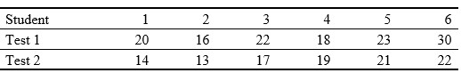

```{r, echo = FALSE, results = "hide"}
include_supplement("uu-Non-parametric-Techniques-800-nl-tabel.jpg", recursive = TRUE)
```

Question
========
  
A psychologist is researching the effect of hypnosis on brain dominance. He does an experiment with 6 students. On the first day, they are hypnotized. Then they take a test that shows how dominant the right hemisphere is relative to the left hemisphere (the higher the score, the more dominant the right side). On another day, the same test is taken, but the students are not hypnotized. The data collected are below:



The psychologist knows that the scores are not normally distributed and wants to apply a nonparametric test to see if hypnosis makes dominance significantly higher. What is the result of the test at $\alpha = .05$? 
Answerlist
----------
* We should $H_0$ reject because $T$ is smaller than $T_{crit} = 2$.
* We can $H_0$ do not reject because $T$ is greater than $T_{criticality} = 0$.
* We can $H_0$ do not reject because $T$ is smaller than $T_{criticality} = 2$.
* We must $H_0$ reject because $T$ is greater than $T_{kritiek} = 0$.


Solution
========

Meta-information
================
exname: uu-Non-parametric-Techniques-800-en
extype: schoice
exsolution: 1000
exsection: Inferential Statistics/Non-parametric Techniques
exextra[Type]: Performing analysis
exextra[Language]: English
exextra[Level]: Statistical Literacy
