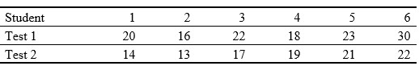

```{r, echo = FALSE, results = "hide"}
include_supplement("uu-Non-parametric-Techniques-800-nl-tabel.jpg", recursive = TRUE)
```


Question
========
  
Een psycholoog doet onderzoek naar het effect van hypnose op hersendominantie. Hij doet een experiment met 6 studenten. Op de eerste dag worden ze gehypnotiseerd. Dan doen ze een test waaruit blijkt hoe dominant de rechterhemisfeer is ten opzichte van de linkerhemisfeer (hoe hoger de score, hoe dominanter de rechterkant). Op een andere dag wordt dezelfde test afgenomen, maar dan zijn de studenten niet gehypnotiseerd. De verzamelde data staan hieronder:



De psycholoog weet dat de scores niet normaalverdeeld zijn en wil een non-parametrische toets toepassen om te kijken of hypnose de dominantie significant hoger maakt. Wat is de uitkomst van de toets bij $\alpha = .05$?
  
Answerlist
----------
* We moeten $H_0$ verwerpen want $T$ is kleiner dan $T_{kritiek} = 2$.
* We kunnen $H_0$ niet verwerpen want $T$ is groter dan $T_{kritiek} = 0$. 
* We kunnen $H_0$ niet verwerpen want $T$ is kleiner dan $T_{kritiek} = 2$.
* We moeten $H_0$ verwerpen want $T$ is groter dan $T_{kritiek} = 0$.


Solution
========
  


Answerlist
----------


Meta-information
================
exname: uu-Non-parametric-Techniques-800-nl.Rmd
extype: schoice
exsolution: 1000
exsection: Inferential Statistics/Non-parametric Techniques
exextra[Type]: Performing analysis
exextra[Language]: Dutch
exextra[Level]: Statistical Literacy
