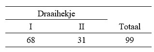

```{r, echo = FALSE, results = "hide"}
include_supplement("uu-Null-hypothesis-803-nl-tabel.jpg", recursive = TRUE)
```

Question
========
  
Two turnstiles have been placed at the entrance to the pool. Because the first gate is placed right next to the cash register and the second gate a few meters away, the first turnstile is expected to be used twice as much as the second gate. To test this, the number of people entering through each gate is counted during a busy period in the afternoon. The data collected is shown in the table below. 



What is the null hypothesis to be tested here? 
Answerlist
----------
* H0: Fence I= 1/2; Fence II 1/4
* H0: Barrier I= 2/3; Barrier II 1/3
* H0: Barrier I= 68; Barrier II 31
* H0: Fence I= 66; Fence II 33

Solution
========

Meta-information
================
exname: uu-Null-hypothesis-803-en
extype: schoice
exsolution: 0100
exsection: Inferential Statistics/NHST/Hypothesis/Null hypothesis
exextra[Type]: Case
exextra[Language]: English
exextra[Level]: Statistical Literacy
