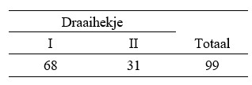

```{r, echo = FALSE, results = "hide"}
include_supplement("uu-Null-hypothesis-803-nl-tabel.jpg", recursive = TRUE)
```


Question
========
  
In het zwembad zijn twee draaihekjes bij de ingang geplaatst. Omdat het eerste hekje pal naast de kassa is geplaats en het tweede hekje een paar meter verderop, wordt er verwacht dat het eerste draaihekje twee keer zoveel gebruikt wordt als het tweede hekje. Om dit te toetsen wordt het aantal mensen dat door ieder hekje naar binnen gaat geteld tijdens een drukke periode in de middag. De verzamelde data staat in de tabel hieronder. 



Wat is de nulhypothese die hier getoetst moet worden?
  
Answerlist
----------
* H0: Hekje I= 1/2; Hekje II 1/4
* H0: Hekje I= 2/3; Hekje II 1/3
* H0: Hekje I= 68; Hekje II 31
* H0: Hekje I= 66; Hekje II 33

Solution
========
  


Meta-information
================
exname: uu-Null-hypothesis-803-nl.Rmd
extype: schoice
exsolution: 0100
exsection: Inferential Statistics/NHST/Hypothesis/Null hypothesis
exextra[ID]: 19dd6
exextra[Type]: Case
exextra[Language]: Dutch
exextra[Level]: Statistical Literacy
