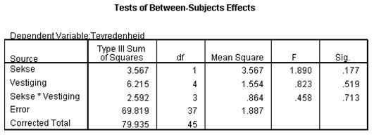

```{r, echo = FALSE, results = "hide"}
include_supplement("uu-Null-hypothesis-805-nl-tabel.jpg", recursive = TRUE)
```

Question
========
  
The manager of a large company with 5 different branches has asked his employees to complete a questionnaire on job satisfaction and working conditions (5-point Likert scale). The manager would like to know if there are differences between male and female employees within the five branches.



Which null hypothesis tests the test size F = 0.458? 
Answerlist
----------
* H0: the average satisfaction scores of men and women are equal
* H0: the average satisfaction scores within the five sites are equal
* H0: the differences (if any) in average satisfaction scores between men and women are equal for all five establishments.
* H0: the differences (if any) in average satisfaction scores between the five establishments are different for men and women.


Solution
========

Meta-information
================
exname: uu-Null-hypothesis-805-en
extype: schoice
exsolution: 0010
exsection: Inferential Statistics/NHST/Hypothesis/Null hypothesis
exextra[ID]: b107e
exextra[Type]: Interpretating output
exextra[Program]: SPSS
exextra[Language]: English
exextra[Level]: Statistical Literacy
