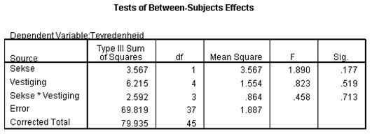

```{r, echo = FALSE, results = "hide"}
include_supplement("uu-Null-hypothesis-805-nl-tabel.jpg", recursive = TRUE)
```


Question
========
  
De manager van een groot bedrijf met 5 verschillende vestigingen heeft aan zijn medewerkers gevraagd om een vragenlijst in te vullen over de tevredenheid op het werk en de werkomstandigheden (5-punts Likert-schaal). De manager wil graag weten of er verschillen zijn tussen de mannelijke en vrouwelijke werknemers binnen de vijf vestigingen.



Welke nulhypothese toetst de toetsingsgrootheid F = 0.458?
  
Answerlist
----------
* H0: de gemiddelde tevredenheidscores van mannen en vrouwen zijn gelijk
* H0: de gemiddelde tevredenheidscores binnen de vijf vestigingen zijn gelijk
* H0: de (eventuele) verschillen in gemiddelde tevredenheidscores tussen mannen en vrouwen zijn gelijk voor alle vijf vestigingen. 
* H0: de (eventuele) verschillen in gemiddelde tevredenheidscores tussen de vijf vestigingen zijn anders voor mannen en vrouwen.


Solution
========
  


Meta-information
================
exname: uu-Null-hypothesis-805-nl.Rmd
extype: schoice
exsolution: 0010
exsection: Inferential Statistics/NHST/Hypothesis/Null hypothesis
exextra[Type]: Interpretating output
exextra[Program]: SPSS
exextra[Language]: Dutch
exextra[Level]: Statistical Literacy
