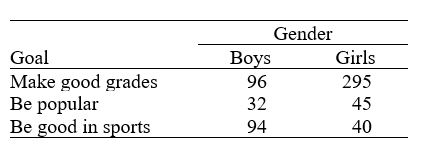

```{r, echo = FALSE, results = "hide"}
include_supplement("uu-Null-hypothesis-808-en-tabel.JPG", recursive = TRUE)
```


Question
========
  
A study was performed to examine the personal goals of children in grades 4, 5, and 6.  A random sample of students was selected from each of the grades 4, 5, and 6 from schools in Georgia.  The students received a questionnaire regarding achieving personal goals.  They were asked what they would most like to do at school: make good grades, be good at sports, or be popular.  Results are presented by the gender of the child in the table below.




What would be the null hypothesis for a chi-square test based on these data? 
  
Answerlist
----------
* Personal goals and gender are independent.
* The mean personal goal is the same for boys and girls 
* The distribution of personal goals is different for boys and girls.
* The distribution of gender is different for the three different personal goals. 

Solution
========
  
Personal goals and gender are independent.

Answerlist
----------
* This answer is correct.
* This answer is incorrect.
* This answer is incorrect.
* This answer is incorrect.

Meta-information
================
exname: uu-Null-hypothesis-808-en.Rmd
extype: schoice
exsolution: 1000
exsection: Inferential Statistics/NHST/Hypothesis/Null hypothesis
exextra[ID]: 544e8
exextra[Type]: Conceptual
exextra[Program]: 
exextra[Language]: English 
exextra[Level]: Statistical Literacy