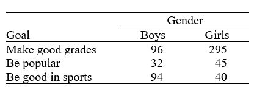

```{r, echo = FALSE, results = "hide"}
include_supplement("uu-Null-hypothesis-808-en-tabel.JPG", recursive = TRUE)
```


Question
========
  
Er werd een onderzoek uitgevoerd om de persoonlijke doelen van kinderen in groep 4, 5 en 6 te onderzoeken.  Een willekeurige steekproef van leerlingen werd geselecteerd uit elk van de klassen 4, 5 en 6 van scholen in Georgia.  De leerlingen kregen een vragenlijst over het bereiken van persoonlijke doelen.  Hen werd gevraagd wat ze het liefst zouden willen doen op school: goede cijfers halen, goed zijn in sport of populair zijn.  De resultaten worden in de onderstaande tabel weergegeven per geslacht van het kind.




Wat zou de nulhypothese zijn voor een chi-kwadraattest op basis van deze gegevens? 
Answerlist
----------
* Persoonlijke doelen en geslacht zijn onafhankelijk.
* Het gemiddelde persoonlijke doel is hetzelfde voor jongens en meisjes.
* De verdeling van persoonlijke doelen is verschillend voor jongens en meisjes.
* De verdeling van geslacht is verschillend voor de drie verschillende persoonlijke doelen. 

Solution
========
  
Persoonlijke doelen en geslacht zijn onafhankelijk.

Answerlist
----------
* Dit antwoord is juist.
* Dit antwoord is onjuist.
* Dit antwoord is onjuist.
* Dit antwoord is onjuist.

Meta-information
================
exname: uu-Null-hypothesis-808-nl
extype: schoice
exsolution: 1000
exsection: Inferential Statistics/NHST/Hypothesis/Null hypothesis
exextra[Type]: Conceptual
exextra[Program]: 
exextra[Language]: Dutch
exextra[Level]: Statistical Literacy