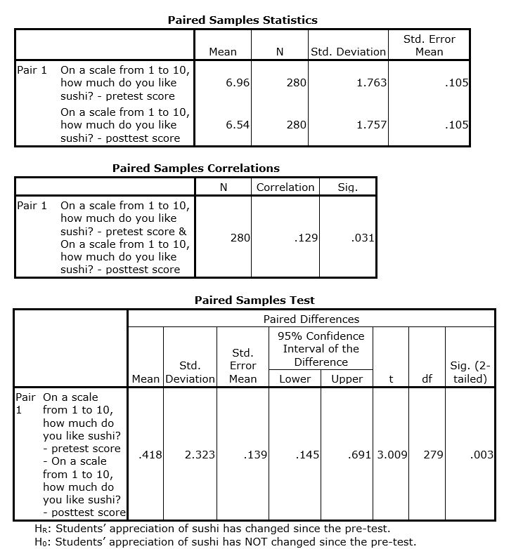

```{r, echo = FALSE, results = "hide"}
include_supplement("uu-Null-hypothesis-813-en-tabel.JPG", recursive = TRUE)
```

Question
========
  
Als onderdeel van een klanttevredenheidsonderzoek vroegen de managers van een eetzaal aan 280 studenten hoe lekker ze verschillende soorten eten vonden (pre-test). Ze ontdekten dat sushi het meest positief werd beoordeeld. Op basis van deze enquête besloten de managers sushi aan te bieden als onderdeel van het lunchmenu. Drie maanden later namen ze opnieuw contact op met de respondenten die deelnamen aan de eerste enquête en vroegen ze opnieuw hoe lekker ze sushi vonden (post-test). De managers van de eetzaal wilden weten of de waardering van studenten voor sushi was veranderd sinds de eerste enquête.

Ze vonden de volgende resultaten:



Welke conclusie zouden ze uit hun gegevens moeten trekken met een significantieniveau van .01?

  
Answerlist
----------
* Er is geen significante verandering in de waardering van studenten voor sushi, dus moeten ze de nulhypothese verwerpen.
* Er is geen significante verandering in de waardering van studenten voor sushi, dus ze moeten de nulhypothese niet verwerpen.
* Er is een significante verandering in de waardering van sushi onder studenten, dus ze moeten de nulhypothese niet verwerpen.
* Er is een significante verandering in de waardering van studenten voor sushi, dus moeten ze de nulhypothese verwerpen.

Solution
========

Answerlist
----------
* Dit antwoord is onjuist.
* Dit antwoord is onjuist.
* Dit antwoord is onjuist.
* Dit antwoord is juist.

Meta-information
================
exname: uu-Null-hypothesis-813-nl
extype: schoice
exsolution: 0001
exsection: Inferential Statistics/NHST/Hypothesis/Null hypothesis
exextra[Type]: Case
exextra[Language]: Dutch
exextra[Level]: Statistical Literacy