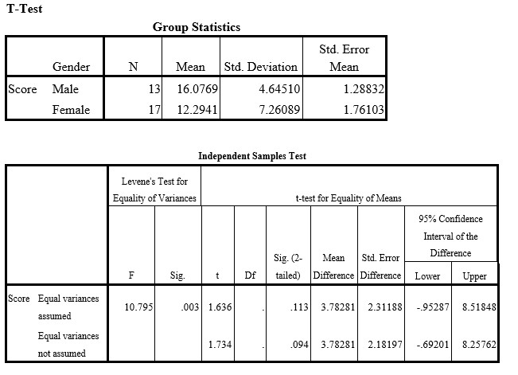

```{r, echo = FALSE, results = "hide"}
include_supplement("uu-Null-hypothesis-815-en-tabel.jpg", recursive = TRUE)
```


Question
========
  
A researcher expects male students to perform better on a given test than female students. To investigate this, he invites 13 males and 17 females to do a mathematical test. All participants make exactly the same test and are given all the time they need to complete it. The researcher then scores the correct answers and executes a t-test in SPSS. The output of the SPSS analysis of this test is below.




What would be the correct decision and motivation of the researcher regarding the null hypothesis?

  
Answerlist
----------
* Reject H0 because males score higher than females.
* Reject H0 because males do not score higher than females.
* Accept H0 because males score higher than females.
* Accept H0 because males do not score higher than females.


Solution
========
  


Meta-information
================
exname: uu-Null-hypothesis-815-en.Rmd
extype: schoice
exsolution: 1000
exsection: Inferential Statistics/NHST/Hypothesis/Null hypothesis
exextra[ID]: 3d852
exextra[Type]: Interpretating output
exextra[Program]: SPSS
exextra[Language]: English
exextra[Level]: Statistical Literacy
