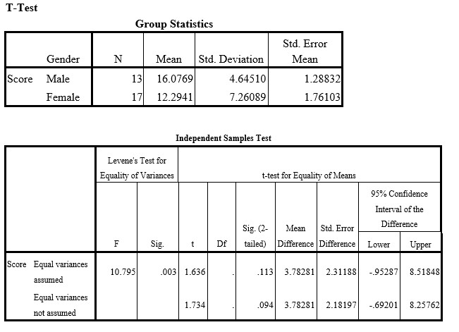

```{r, echo = FALSE, results = "hide"}
include_supplement("uu-Null-hypothesis-815-en-tabel.jpg", recursive = TRUE)
```

Question
========
  
Een onderzoeker verwacht dat mannelijke studenten beter presteren op een bepaalde test dan vrouwelijke studenten. Om dit te onderzoeken nodigt hij 13 mannen en 17 vrouwen uit om een wiskundige test te maken. Alle deelnemers maken exact dezelfde test en krijgen alle tijd die ze nodig hebben. De onderzoeker scoort vervolgens de juiste antwoorden en voert een t-test uit in SPSS. De uitvoer van de SPSS-analyse van deze test staat hieronder.




Wat zou de juiste beslissing en motivatie van de onderzoeker zijn met betrekking tot de nulhypothese?

  
Answerlist
----------
* Verwerp H0 omdat mannen hoger scoren dan vrouwen.
* Verwerp H0 omdat mannetjes niet hoger scoren dan vrouwtjes.
* Accepteer H0 omdat mannetjes hoger scoren dan vrouwtjes.
* Accepteer H0 omdat mannetjes niet hoger scoren dan vrouwtjes.


Solution
========

Meta-information
================
exname: uu-Null-hypothesis-815-nl
extype: schoice
exsolution: 1000
exsection: Inferential Statistics/NHST/Hypothesis/Null hypothesis
exextra[Type]: Interpretating output
exextra[Program]: SPSS
exextra[Language]: Dutch
exextra[Level]: Statistical Literacy
