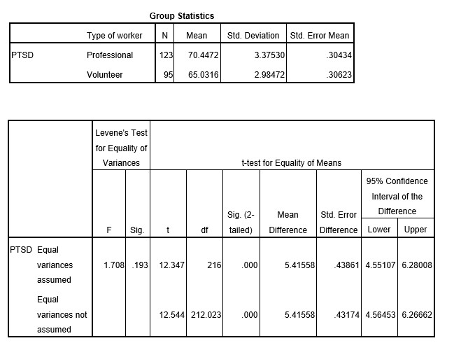

```{r, echo = FALSE, results = "hide"}
include_supplement("uu-Null-hypothesis-816-en-tabel.jpg", recursive = TRUE)
```


Question
========
  
A team of researchers is interested in post-traumatic stress symptoms experienced by rescue workers after a major earth quake. They want to investigate if volunteer rescue workers experience higher levels of PTSD than members of professional rescue squads. Three weeks after the earthquake, 95 volunteers and 123 professional rescue workers completed a questionnaire in which PTSD symptoms were measured on a scale from 0 to 100.

They find the following results:




At a significance level of $\alpha$ = .05, should the researchers reject the null hypothesis?
  
Answerlist
----------
* They should reject H0, since the results indicate a significant difference in stress levels.
* They should not reject H0 since the results indicate there is no difference in stress levels between volunteers and professionals.
* They should not reject H0, even though the p-value given by SPSS is smaller than $\alpha$. 
* They should reject H0 since the difference between the groups is non-significant.


Solution
========
  


Meta-information
================
exname: uu-Null-hypothesis-816-en.Rmd
extype: schoice
exsolution: 0010
exsection: Inferential Statistics/NHST/Hypothesis/Null hypothesis
exextra[ID]: d0728
exextra[Type]: Interpretating output
exextra[Program]: SPSS
exextra[Language]: English
exextra[Level]: Statistical Literacy
