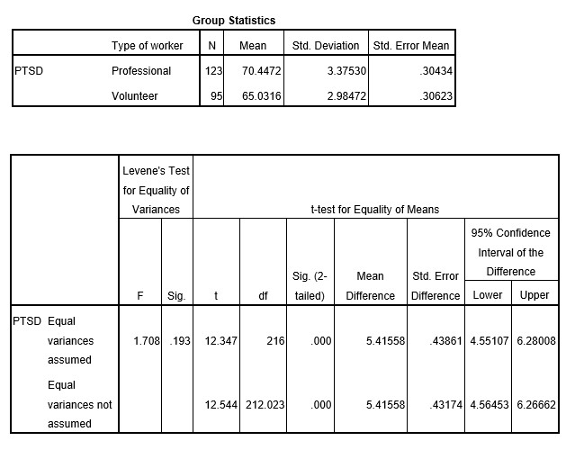

```{r, echo = FALSE, results = "hide"}
include_supplement("uu-Null-hypothesis-816-en-tabel.jpg", recursive = TRUE)
```

Question
========
  
Een team onderzoekers is geïnteresseerd in posttraumatische stresssymptomen die reddingswerkers ervaren na een zware aardbeving. Ze willen onderzoeken of vrijwillige reddingswerkers hogere niveaus van PTSS ervaren dan leden van professionele reddingsploegen. Drie weken na de aardbeving vulden 95 vrijwilligers en 123 professionele reddingswerkers een vragenlijst in waarin PTSS-symptomen werden gemeten op een schaal van 0 tot 100.

Ze vonden de volgende resultaten:




Bij een significantieniveau van $\alpha$ = .05, moeten de onderzoekers dan de nulhypothese verwerpen? 
Antwoordlijst
----------
* Ze moeten H0 verwerpen, omdat de resultaten een significant verschil in stressniveaus aangeven.
* Ze zouden H0 niet moeten verwerpen, omdat de resultaten aangeven dat er geen verschil is in stressniveaus tussen vrijwilligers en professionals.
* Ze zouden H0 niet moeten verwerpen, ook al is de p-waarde die SPSS geeft kleiner dan $\alpha$.
* Ze moeten H0 verwerpen omdat het verschil tussen de groepen niet significant is.


Solution
========

Meta-information
================
exname: uu-Null-hypothesis-816-nl
extype: schoice
exsolution: 0010
exsection: Inferential Statistics/NHST/Hypothesis/Null hypothesis
exextra[Type]: Interpretating output
exextra[Program]: SPSS
exextra[Language]: Dutch
exextra[Level]: Statistical Literacy
