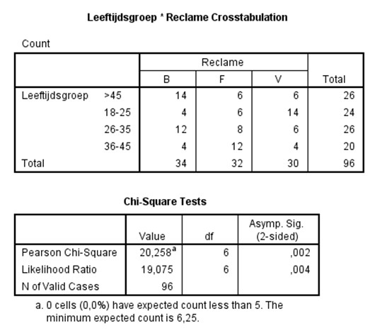

```{r, echo = FALSE, results = "hide"}
include_supplement("uu-Null-hypothesis-818-nl-tabel.jpg", recursive = TRUE)
```

Question
========
  
It examines whether a relationship can be found between the type of advertisement (indicated by the letters B, F and V) and age group. Part of the SPSS output is below.



Which of the following alternatives is the null hypothesis? 
Answerlist
----------
* Age group and spot preferred are correlated.
* Age group and spot preferred are independent.
* The distribution for preferred spot is not the same for all age groups.
* Frequencies in all categories are the same.


Solution
========

Answerlist
----------
* The null hypothesis always assumes no difference or no correlation.
* The null hypothesis in this chi-square distribution is that the variables are independent.
* The null hypothesis always assumes no difference or no correlation.
* The hypothesis does not relate to the frequencies, as these always depend on the sample size.

Meta-information
================
exname: uu-Null-hypothesis-818-en
extype: schoice
exsolution: 0100
exsection: Inferential Statistics/NHST/Hypothesis/Null hypothesis
exextra[Type]: Interpretating output
exextra[Program]: SPSS
exextra[Language]: English
exextra[Level]: Statistical Literacy
