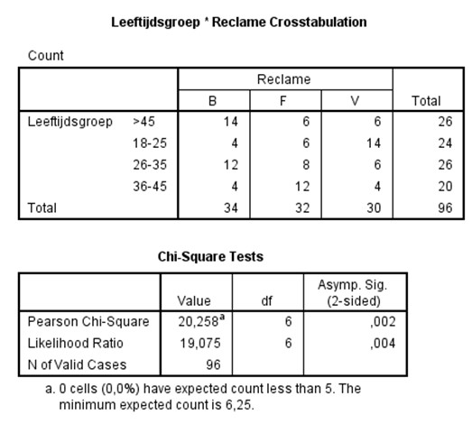

```{r, echo = FALSE, results = "hide"}
include_supplement("uu-Null-hypothesis-818-nl-tabel.jpg", recursive = TRUE)
```


Question
========
  
Er wordt gekeken of er een relatie te vinden is tussen het soort reclamespotje (aangegeven door de letters B, F en V) en leeftijdsgroep. Deel van de SPSS output staat hieronder.



Welke van onderstaande alternatieven is de nulhypothese?
  
Answerlist
----------
* Leeftijdsgroep en  spotje waaraan de voorkeur wordt gegeven zijn gecorreleerd.
* Leeftijdsgroep en spotje waaraan de voorkeur wordt gegeven zijn onafhankelijk.
* De verdeling voor voorkeur voor een spotje is niet voor alle leeftijdsgroepen hetzelfde.
* De frequenties in alle categorieën zijn hetzelfde.


Solution
========


Answerlist
----------
* De nulhypothese gaat altijd uit van geen verschil of geen samenhang.
* De nulhypothese bij deze chi-kwadraat verdeling is dat de variabelen onafhankelijk zijn. 
* De nulhypothese gaat altijd uit van geen verschil of geen samenhang.
* De hypothese heeft geen betrekking op de frequenties, deze zijn nl. altijd afhankelijk van de steekproefomvang.


Meta-information
================
exname: uu-Null-hypothesis-818-nl.Rmd
extype: schoice
exsolution: 0100
exsection: Inferential Statistics/NHST/Hypothesis/Null hypothesis
exextra[Type]: Interpretating output
exextra[Program]: SPSS
exextra[Language]: Dutch
exextra[Level]: Statistical Literacy
