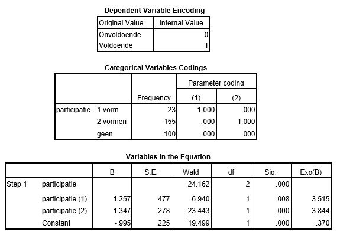

```{r, echo = FALSE, results = "hide"}
include_supplement("uu-Odds-801-nl-tabel.jpg", recursive = TRUE)
```

Question
========

An instructor wants to predict satisfactory or unsatisfactory completion of an exam based on participation during the course. Participation is measured using three categories: no lectures taken ("none"), only lectures or instructional lectures taken ("1 form"), both lectures and instructional lectures taken ("2 forms"). Below are the results of the analysis.
  


What conclusion can the teacher draw about the Exp(B) of participation (2)? 
Answerlist
----------
* The odds that someone who attends both forms of education will pass the exam are 3.84 times greater than those of the participants who do not attend lectures.
* The odds that someone who takes both forms of education will pass the exam are 3.84 times greater than those of the participants who take only one form.
* The odds of a person taking both forms of instruction passing the exam are 3.84 times greater than those of the other groups.
* The odds of a person taking both forms of instruction passing the exam are 3.84 times greater than those of the participants not taking lectures.


Solution
========

Meta-information
================
exname: uu-Odds-801-en
extype: schoice
exsolution: 1000
exsection: Inferential Statistics/Regression/Logistic regression/Odds
exextra[ID]: 4e78a
exextra[Type]: Interpretating output
exextra[Program]: SPSS
exextra[Language]: English
exextra[Level]: Statistical Literacy
