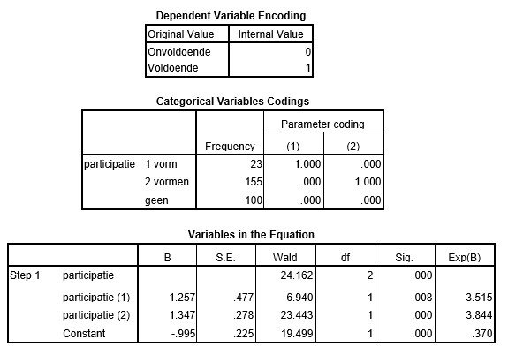

```{r, echo = FALSE, results = "hide"}
include_supplement("uu-Odds-801-nl-tabel.jpg", recursive = TRUE)
```


Question
========

Een docent wil het wel of niet voldoende afsluiten van een tentamen voorspellen aan de hand van de participatie tijdens de cursus. Participatie wordt gemeten aan de hand van drie categorieën: geen colleges gevolgd (“geen”), enkel hoorcolleges of instructiecolleges gevolgd (“1 vorm”), zowel hoor- als instructiecolleges gevolgd (“2 vormen”). Hieronder staan de resultaten van de analyse.
  


Welke conclusie kan de docent trekken over de Exp(B) van participatie (2)?
  
Answerlist
----------
* De odds dat iemand die beide onderwijsvormen volgt het tentamen voldoende afsluit zijn 3.84 keer groter dan die van de participanten die geen colleges volgen. 
* De odds dat iemand die beide onderwijsvormen volgt het tentamen voldoende afsluit zijn 3.84 keer groter dan die van de participanten die slechts één vorm volgen.
* De odds dat iemand die beide onderwijsvormen volgt het tentamen voldoende afsluit zijn 3.84 keer groter dan die van de andere groepen.
* De kans dat iemand die beide onderwijsvormen volgt het tentamen voldoende afsluit is 3.84 keer groter dan die van de participanten die geen colleges volgen.


Solution
========
  


Meta-information
================
exname: uu-Odds-801-nl.Rmd
extype: schoice
exsolution: 1000
exsection: Inferential Statistics/Regression/Logistic regression/Odds
exextra[Type]: Interpretating output
exextra[Program]: SPSS
exextra[Language]: Dutch
exextra[Level]: Statistical Literacy
