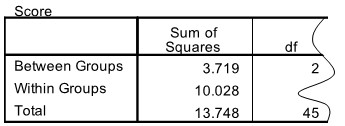

```{r, echo = FALSE, results = "hide"}
include_supplement("uu-Oneway-ANOVA-823-nl-tabel.jpg", recursive = TRUE)
```


Question
========

De Cognitive Failure Questionnaire meet aan de hand van 25 vragen de subjectieve evaluatie van eigen cognitieve vermogens: het gaat er hierbij om in hoeverre mensen de afgelopen tijd last hebben ondervonden van dagelijkse vergissingen. De gemiddelde scores (gemiddelde genomen over de 25 vragen) worden berekend voor drie groepen ouderen: ouderen die zelfstandig thuis wonen zonder partner, ouderen die zelfstandig thuis wonen met partner en ouderen die in een aanleunwoning wonen. Om te kijken of er verschillen zijn tussen deze drie groepen ouderen, is SPSS gebruikt. 

De output is helaas gescheurd. Het overgebleven stuk staat hieronder. 




Wat is de waarde van de toetsingsgrootheid van deze toets?
  
Answerlist
----------
* 7.97
* 1.86
* 0.37
* 6.09


Solution
========
  


Answerlist
----------


Meta-information
================
exname: uu-Oneway ANOVA-823-nl.Rmd
extype: schoice
exsolution: 1000
exsection: Inferential Statistics/Parametric Techniques/ANOVA/Oneway ANOVA
exextra[Type]: Interpretating output
exextra[Program]: SPSS
exextra[Language]: Dutch
exextra[Level]: Statistical Literacy
