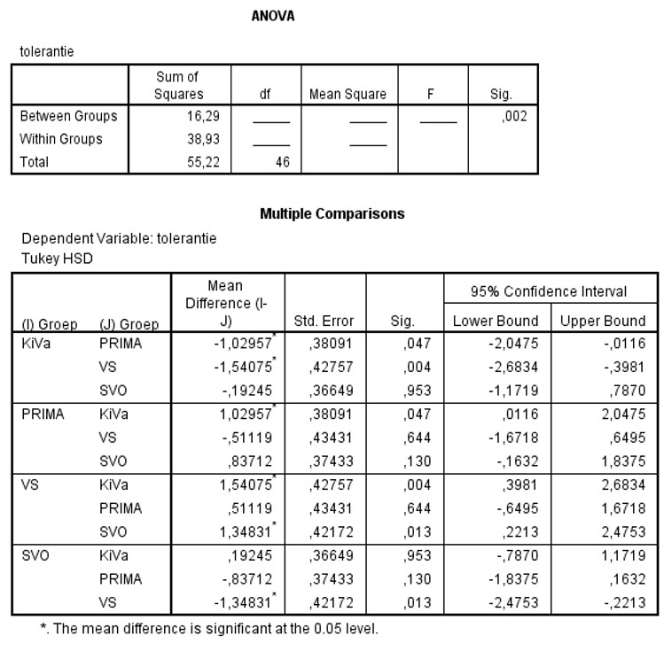

```{r, echo = FALSE, results = "hide"}
include_supplement("uu-Oneway-ANOVA-826-nl-tabel.jpg", recursive = TRUE)
```


Question
========
  
Op basisscholen worden verschillende programma’s gebruikt om kinderen met elkaar om te leren gaan en ze op de gevolgen van pesten te wijzen. Vier van deze programma’s werden in een recent onderzoek met elkaar vergeleken:
• KiVa – een antipestprogramma uit Finland
• PRIMA -- PRoefImpleMentatie Antipestbeleid in het basisonderwijs
• VS – Vreedzame School
• SVO – Stichting Veilig Onderwijs
Een maat van onderlinge tolerantie werd gebruikt als indicatie van de effectiviteit van het programma. Een deel van de SPSS output staat hieronder. 




Wat is de juiste waarde van de F-ratio en de daarbij horende vrijheidsgraden (degrees of freedom)? Maak bij het berekenen van de tussenstappen gebruik van 3 decimalen / 3 cijfers achter de komma.
  
Answerlist
----------
* F(3, 43) = 6.00
* F(3, 43) = 0.17
* F(4, 42) = 4.39
* F(4, 42) = 0.23 


Solution
========
$df_{tussen}$ = aantal groepen – 1 = 4 – 1 = 3 en $df_{binnen}$ = $df_{totaal}$ – $df_{tussen}$ = 46 – 3 = 43.
Hiermee zijn uit de SS de MS =  SS / df te berekenen:
$MS_{tussen}$ = 16.29 / 3 = 5.430;
$MS_{binnen}$ = 38.93 / 43 ≈ 0.905.
Hieruit volgt F = $MS_{tussen}$ /  $MS_{binnen}$ = 5.430 / 0.905 = 6.00.


Answerlist
----------


Meta-information
================
exname: uu-Oneway ANOVA-826-nl.Rmd
extype: schoice
exsolution: 1000
exsection: Inferential Statistics/Parametric Techniques/ANOVA/Oneway ANOVA
exextra[Type]: Interpretating output
exextra[Program]: SPSS
exextra[Language]: Dutch
exextra[Level]: Statistical Literacy
