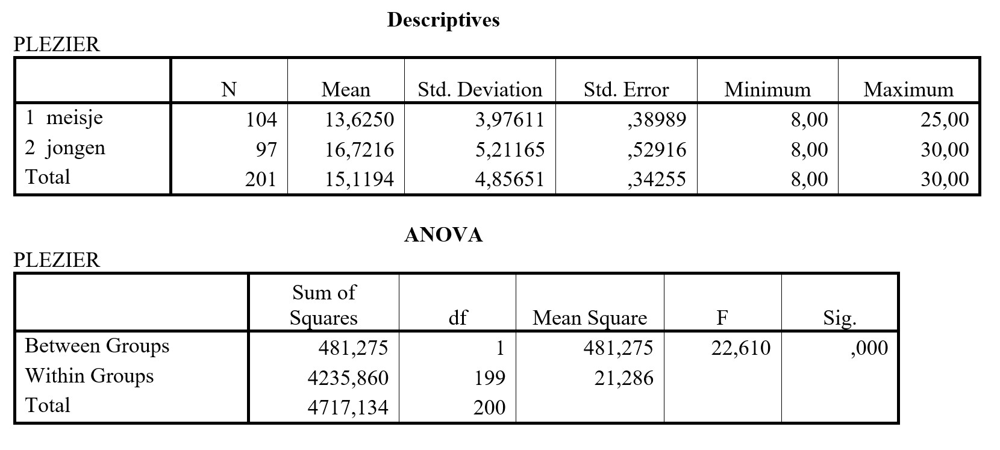

```{r, echo = FALSE, results = "hide"}
include_supplement("uu-Oneway-ANOVA-861-nl-graph01.jpg", recursive = TRUE)
```
Question
========
In een onderzoek naar schoolplezier is aan leerlingen van groep 7 van een aantal basisscholen een vragenlijst voorgelegd met 8 vragen die het schoolplezier (of het gebrek daaraan) meten. Bij alle vragen waren er vier antwoordcategorieën waarbij een hoge score betekende dat de leerling plezier had in het naar school gaan. 
Middels variantie-analyse is nagegaan of jongens en meisjes verschillen in schoolplezier. Getoetst is met $\alpha$ = 5%. De SPSS-output staat hieronder.




Wat is de conclusie op basis van deze output?

Answerlist
----------
* Jongens en meisjes verschillen significant in schoolplezier; een post hoc  analyse moet uitwijzen of de jongens of juist de meisjes meer plezier hebben
* Jongens en meisjes verschillen significant in schoolplezier, jongens hebben meer plezier dan meisjes
* Jongens en meisjes verschillen niet in schoolplezier, daarom moet een post hoc analyse uitgevoerd worden
* De vraag of jongens en meisjes verschillen in schoolplezier kan uitsluitend beantwoord worden met een Independent samples T-test, niet met variantie-analyse.


Solution
========


Meta-information
================
exname: uu-Oneway ANOVA-861-nl
extype: schoice
exsolution: 0100
exsection: Inferential Statistics/Parametric Techniques/ANOVA/Oneway ANOVA
exextra[Type]: Interpretating output
exextra[Program]: 
exextra[Language]: Dutch
exextra[Level]: Interpretating output