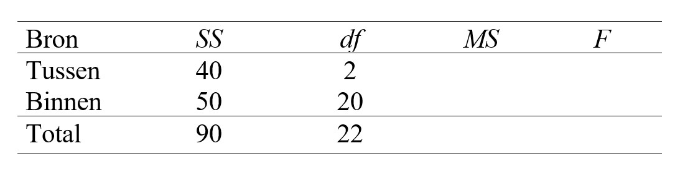

```{r, echo = FALSE, results = "hide"}
include_supplement("uu-Oneway-ANOVA-863-nl-graph01.jpg", recursive = TRUE)
```
Question
========
Uit een onderzoek is het resultaat in onderstaande ANOVA-tabel gepresenteerd.



Hieruit blijkt dat:

Answerlist
----------
* Het gevonden resultaat is niet significant op 5% want $F_{obt}$ > $F_{crit}$
* Het gevonden resultaat is significant op 5% want $F_{obt}$ < $F_{crit}$
* Het gevonden resultaat is significant op 5% want $F_{obt}$ > $F_{crit}$
* Het gevonden resultaat is niet significant op 5% want $F_{obt}$ < $F_{crit}$


Solution
========


Answerlist
----------


Meta-information
================
exname: uu-Oneway ANOVA-863-nl
extype: schoice
exsolution: 0010
exsection: Inferential Statistics/Parametric Techniques/ANOVA/Oneway ANOVA
exextra[Type]: Interpretating output
exextra[Program]: 
exextra[Language]: Dutch
exextra[Level]: Statistical Reasoning