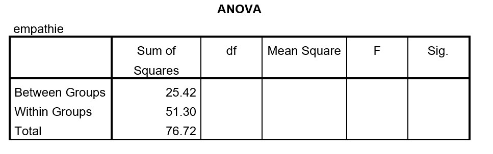

```{r, echo = FALSE, results = "hide"}
include_supplement("uu-Oneway-ANOVA-873-nl-graph01.jpg", recursive = TRUE)
```
Question
========
SPSS wordt gebruikt om data te analyseren van een experiment met kinderen. Vier groepen, ieder van 15 kinderen, krijgen elk een ander filmpje over een kind te zien. In groep A) wordt het kind gepest, B) valt het kind en loopt huilend weg, C) valt het kind en wordt het door een leerkracht getroost, en D) speelt het kind. Na afloop wordt de mate van empathie gemeten bij alle kinderen. Hebben de filmpjes een verschillend effect op de gemiddelde empathiescores? Een deel van de output staat hieronder.



Een deel van de spreiding in de empathiescores wordt verklaard door het feit dat de kinderen verschillend reageren op de verschillende filmpjes en een deel blijft onverklaard. Welk percentage van de spreiding blijft onverklaard?

Answerlist
----------
* 66.9%
* 51.3%
* 33.1%
* 25.4%


Solution
========
De proportie verklaarde spreiding kun je uitrekenen met de formule: 
$\begin{equation*} \eta^2 = \frac{SS_{between}}{SS_{total}} = \frac{25.42}{76.72} = 0.331 \end{equation*}$
 
De proportie onverklaarde spreiding is dan wat rest: 1 - 0.331 = 0.669 of:
 
$\begin{equation*} \eta^2 =  \frac{SS_{within}}{SS_{total}} = \frac{51.30}{76.72} = 0.669 \end{equation*}$


Meta-information
================
exname: uu-Oneway ANOVA-873-nl
extype: schoice
exsolution: 1000
exsection: Inferential Statistics/Parametric Techniques/ANOVA/Oneway ANOVA
exextra[Type]: Interpretating output, Calculation
exextra[Program]: SPSS
exextra[Language]: Dutch
exextra[Level]: Statistical Reasoning