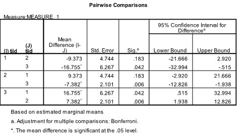

```{r, echo = FALSE, results = "hide"}
include_supplement("uu-Oneway-repeated-measures-ANOVA-601-nl-tabel.jpg", recursive = TRUE)
```

Question
========
  
A study was conducted in which a person's openness within a relationship was measured at three time points. To further examine the differences between the time points, Post-Hoc tests were conducted. 


  
What conclusion can be drawn from these outputs?

Answerlist
----------
* There is no significant increase in openness between time 1 and 2, but there is a significant increase between time 1 and 3, and time 2 and 3.
* There is no significant decrease in openness between time 1 and 2, but there is a significant increase between time 1 and 3, and time 2 and 3.
* There is a significant increase in openness between time 1 and 2, but no significant increase between time 1 and 3, and time 2 and 3.
* There is a significant decrease in openness between time 1 and 2, but no significant decrease between time 1 and 3, and time 2 and 3.  


Solution
========

Meta-information
================
exname: uu-Oneway-repeated-measures-ANOVA-601-en
extype: schoice
exsolution: 1000
exsection: Inferential Statistics/Parametric Techniques/ANOVA/Oneway repeated measures ANOVA
exextra[ID]: c79e3
exextra[Type]: Interpretating output
exextra[Program]: SPSS
exextra[Language]: English
exextra[Level]: Statistical Literacy
